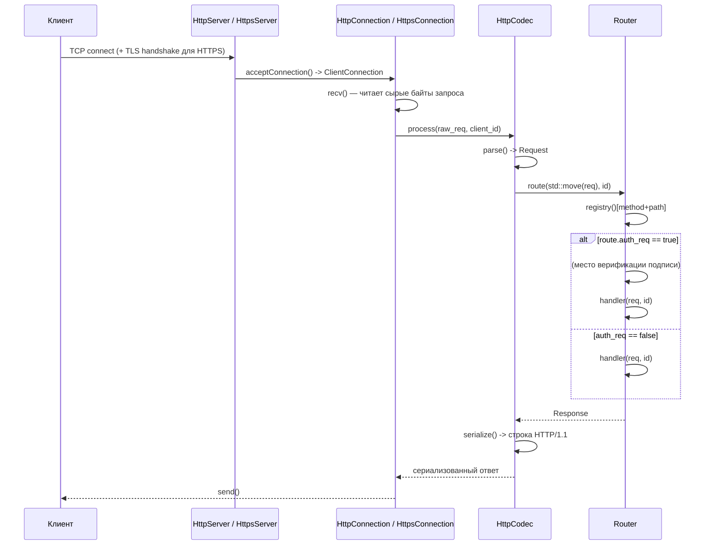

# http-https-server

Лёгкий каркас HTTP/HTTPS-сервера на C++17 поверх «сырых» POSIX-сокетов и OpenSSL — без сторонних веб-фреймворков (Boost.Beast, Crow, Drogon и т.п.). Проект даёт базовый TCP/TLS-цикл приёма соединений, разбор HTTP-запроса, статический реестр маршрутов и единый JSON-конверт для ответов — то есть фундамент, на котором удобно строить собственный REST/JSON API.

## Содержание

- [Особенности](#особенности)
- [Архитектура](#архитектура)
- [Структура репозитория](#структура-репозитория)
- [Модель запрос/ответ](#модель-запросответ)
- [Коды результата (retCode)](#коды-результата-retcode)
- [Роутинг](#роутинг)
  - [Регистрация через `Router::add`](#регистрация-через-routeradd)
  - [Регистрация через `HTTP_REGISTER_HANDLER`](#регистрация-через-http_register_handler)
- [Аутентификация запросов](#аутентификация-запросов)
- [Логирование](#логирование)
- [Зависимости](#зависимости)
- [Сборка](#сборка)
- [TLS-сертификаты](#tls-сертификаты)
- [Запуск](#запуск)
- [Пример запроса](#пример-запроса)
- [Известные ограничения / TODO](#известные-ограничения--todo)
- [Лицензия](#лицензия)

## Особенности

- **HTTP и HTTPS** — `http::HttpServer` работает поверх обычных сокетов, `https::HttpsServer` наследуется от него и добавляет TLS-рукопожатие через OpenSSL (`SSL_CTX`, `cert.pem`/`key.pem`).
- **Собственный роутер** — `http::Router` хранит статический реестр `"<METHOD><path>" -> Route{handler, auth_req}` и диспетчеризует запросы без внешних зависимостей.
- **Единый конверт ответа** — любой обработчик возвращает `Response`, а `makeResp()` формирует тело вида `{ retCode, retMesg, time, result }` и параллельно сопоставляет внутренний код результата с корректным HTTP-статусом.
- **JSON из коробки** — тело запроса/ответа — `nlohmann::ordered_json` (сохраняет порядок полей).
- **Структурированное логирование** — `logrr::Logger` / `logrr::StatusLogger` с несколькими sink’ами (`ConsoleSink`, `FileSink`) и форматами (`SingleLineFormatter`, `JsonFormatter`), плюс уровни `trace…critical` и парные хелперы `lCalled/lExeced/lFailed/lError/...`.
- **UUID v4** для идентификации клиентов и трассировки запросов (`X-Request-Id` в каждом ответе).
- **~50 предопределённых кодов результата** (`http::retCode`) с готовым маппингом на HTTP-статусы (`http::status`) и человекочитаемым описанием.

## Архитектура



Жизненный цикл соединения (`HttpServer::listenInternal` → `clientIntakeCycle`) синхронный и блокирующий: `accept()` → создать `HttpConnection` → `process()` (recv → execution → send) → соединение закрывается в деструкторе. Для HTTPS перед созданием соединения дополнительно выполняется `SSL_accept` (`HttpsServer::sslHandshake`).

## Структура репозитория

```
http-https-server/
├── CMakeLists.txt
├── LICENSE
├── include/
│   ├── http_server.h        # базовый TCP-сервер (bind/listen/accept)
│   ├── https_server.h       # TLS-обвязка над HttpServer
│   ├── http_connection.h    # приём/отправка байт одного клиента
│   ├── https_connection.h   # то же самое поверх SSL_read/SSL_write
│   ├── http_codec.h         # parse/serialize + вызов роутера
│   ├── http_message.h       # структуры Request / Response, makeResp()
│   ├── router.h             # Router, Route, HTTP_REGISTER_HANDLER
│   ├── status.h             # enum http::status (HTTP-коды)
│   ├── ret_status.h         # enum http::retCode + маппинг на http::status
│   ├── logging.h            # Logger, sink'и, форматтеры
│   ├── status_logging.h     # StatusLogger (retCode/status -> лог)
│   ├── log_status.h         # уровни логирования
│   ├── net_constants.h      # порт/буферы/лимиты по умолчанию
│   ├── tostring.h           # универсальный convertToString<T>()
│   └── uuid.h               # генератор UUID v4
├── impl/                    # .cc-реализации к заголовкам выше
│   ├── server.cc            # точка входа (main), пример запуска HttpsServer
│   ├── http_server.cc
│   ├── https_server.cc
│   ├── http_connection.cc
│   ├── https_connection.cc
│   ├── http_message.cc
│   ├── http_codec.cc
│   ├── router.cc
│   ├── logging.cc
│   ├── status_logging.cc
│   ├── status.cc
│   ├── log_status.cc
│   └── uuid.cc
└── scripts/
    └── realise.sh
```

## Модель запрос/ответ

```cpp
struct Request {
    std::string method  = "";
    std::string path    = "";
    std::string version = "HTTP/1.1";
    std::unordered_map<std::string, std::string,
                        CaseInsensitiveHash, CaseInsensitiveEqual> headers; // регистронезависимые
    nlohmann::ordered_json body;
};

struct Response {
    http::status status;
    std::unordered_map<std::string, std::string,
                        CaseInsensitiveHash, CaseInsensitiveEqual> headers;
    nlohmann::ordered_json body;
};
```

Формировать `Response` вручную обычно не требуется — для этого есть `makeResp()`:

```cpp
Response makeResp(
    http::retCode retcode,
    const std::string& id,
    const nlohmann::ordered_json& result = nlohmann::json::object()
);
```

Она сама выставляет `status` (через `toHttpStatus(retcode)`), кладёт `X-Request-Id: <id>` в заголовки и формирует тело:

```json
{
  "retCode": 0,
  "retMesg": "Success",
  "time": 1737654321000,
  "result": { }
}
```

## Коды результата (retCode)

`include/ret_status.h` определяет прикладной enum `http::retCode`, для каждого значения есть маппинг на `http::status` (`toHttpStatus`) и текстовое описание (`retMesg`). Несколько примеров:

| retCode                       | HTTP-статус | Значение                                   |
|--------------------------------|-------------|---------------------------------------------|
| `Success`                      | 200/201/202 | Успех (конкретный код передаётся отдельно)   |
| `InvalidJsonOrParams`          | 400         | Некорректный JSON или параметры              |
| `AuthError`                    | 401         | Ошибка авторизации                           |
| `InvalidSignature`             | 401         | Неверная подпись запроса                     |
| `ClockSkewExceedsRecvWindow`   | 401         | Рассинхронизация времени превышает `recvWindow` |
| `SessionOrSignatureExpired`    | 401         | Истёк срок действия сессии/подписи           |
| `Forbidden`                    | 403         | Недостаточно прав/scope                      |
| `NotFound`                     | 404         | Маршрут/ресурс не найден                     |
| `RateLimitExceeded`            | 429         | Превышен лимит запросов                      |
| `InternalError`                | 500         | Внутренняя ошибка сервера                    |

Полный список (~40 кодов, включая специфичные для торговой предметной области — `InsufficientBalance`, `PostOnlyWouldCross`, `PriceOrQtyNotAligned` и т.д.) смотрите в `include/ret_status.h`.

## Роутинг

Ядро — `http::Router`:

```cpp
using Handler = std::function<Response(Request&&, const std::string&)>;

struct Route {
    Handler handler;
    bool auth_req = true;
};

class Router {
public:
    static std::unordered_map<std::string, Route>& registry();
    static bool add(const std::string& method, const std::string& path, Handler h, bool auth_req = true);
    Response route(Request&& req, const std::string& id) const noexcept;
};
```

Ключ реестра — конкатенация `method + path` (без разделителя), например `"GET/orders"`. Метод и путь берутся ровно такими, какими их распарсил `HttpCodec::parse` из стартовой строки запроса (метод — как прислал клиент, обычно `GET`/`POST`/… в верхнем регистре; путь — без query-string-нормализации).

### Регистрация через `Router::add`

Самый предсказуемый способ — вызвать `Router::add` до старта `listen()`, например в `main()`:

```cpp
#include "router.h"
#include "https_server.h"

using namespace http;

int main() {
    Router::add("GET", "/ping", [](Request&& req, const std::string& id) -> Response {
        return makeResp(retCode::Success, id, {{"pong", true}});
    }, /*auth_req=*/false);

    Router::add("POST", "/orders", [](Request&& req, const std::string& id) -> Response {
        // req.body уже распарсен как nlohmann::ordered_json
        return makeResp(retCode::Success, id, {{"orderId", "..."}});
    }, /*auth_req=*/true);

    https::HttpsServer server;
    server.addSink(std::make_shared<logrr::FileSink>());
    server.listen();
}
```

`Router::add` возвращает `false`, если маршрут `method+path` уже занят — полезно, чтобы отловить дубли на старте.

### Регистрация через `HTTP_REGISTER_HANDLER`

В `router.h` предусмотрен макрос для автоматической регистрации на этапе статической инициализации (удобно, когда обработчики раскиданы по разным `.cc`-файлам и не хочется собирать их вручную в одном `main`):

```cpp
#define HTTP_CONCAT_IMPL(a, b) a##b
#define HTTP_CONCAT(a, b) HTTP_CONCAT_IMPL(a, b)

#define HTTP_REGISTER_HANDLER(method, path, func, auth) \
    static ::http::Router::AutoRegistry HTTP_CONCAT(_auto_reg_, __LINE__)(method, path, func, auth)
```

Использование:

```cpp
// orders_handlers.cc
#include "router.h"

http::Response getOrderHandler(http::Request&& req, const std::string& id) {
    return http::makeResp(http::retCode::Success, id, {{"status", "ok"}});
}

HTTP_REGISTER_HANDLER("GET", "/orders", getOrderHandler, /*auth=*/true);
```

## Аутентификация запросов

Диспетчеризация проходит через `Router::route()` (`impl/router.cc`). Именно там сейчас находится точка расширения для дополнительной верификации — она вызывается **до** передачи запроса в обработчик, только если у маршрута выставлен `auth_req = true`:

```cpp
Response resp;
if (r.auth_req) {
    /**
     * Authentication verification is required here
     *
     *      X-Timestamp: xxxx
     *      X-Recv-Window: xxx
     *      X-Signature: xxxxxx
     */
    resp = r.handler(std::forward<Request>(req), id);
}
else {
    resp = r.handler(std::forward<Request>(req), id);
}
```

Сейчас блок — заглушка (обработчик вызывается безусловно вне зависимости от `auth_req`). В проекте уже заложены подходящие коды ошибок под HMAC-подобную схему подписи (`retCode::InvalidSignature`, `retCode::ClockSkewExceedsRecvWindow`, `retCode::SessionOrSignatureExpired`, `retCode::AuthError`), так что реализация может выглядеть примерно так:

```cpp
Response resp;
if (r.auth_req) {
    auto it_ts  = req.headers.find("X-Timestamp");
    auto it_rw  = req.headers.find("X-Recv-Window");
    auto it_sig = req.headers.find("X-Signature");

    if (it_ts == req.headers.end() || it_rw == req.headers.end() || it_sig == req.headers.end()) {
        return makeResp(retCode::AuthError, id);
    }

    int64_t ts          = std::stoll(it_ts->second);
    int64_t recv_window  = std::stoll(it_rw->second);
    int64_t now          = get_timestamp_ms();

    if (std::llabs(now - ts) > recv_window) {
        return makeResp(retCode::ClockSkewExceedsRecvWindow, id);
    }

    // payload обычно: METHOD + PATH + X-Timestamp (+ query/body) — конкретную схему фиксируете сами
    std::string payload = req.method + req.path + it_ts->second + req.body.dump();
    std::string expected_sig = hmacSha256Hex(payload, apiSecret(req));  // ваша реализация

    if (expected_sig != it_sig->second) {
        return makeResp(retCode::InvalidSignature, id);
    }

    resp = r.handler(std::forward<Request>(req), id);
}
else {
    resp = r.handler(std::forward<Request>(req), id);
}
```

Практические замечания:

- `Router::route` объявлен `noexcept` — исключения (например, из `std::stoll` на некорректном заголовке) внутри блока верификации нужно перехватывать самостоятельно и превращать в `makeResp(retCode::InvalidJsonOrParams, id)`, иначе процесс завершится через `std::terminate`.
- Для HMAC-подписи в проекте уже подключён OpenSSL (`OpenSSL::Crypto` в `CMakeLists.txt`) — можно использовать `EVP_MAC`/`HMAC()` без добавления новых зависимостей.
- `apiSecret(req)` — где-то нужно достать секрет по идентификатору клиента/ключа API (например, из заголовка `X-Api-Key` + внешнего хранилища); в текущем каркасе такого механизма нет, его нужно добавить отдельно.

## Логирование

- `logrr::Logger` — базовый логгер с набором sink’ов (`addSink`) и уровней (`lTrace/lDebug/lInfo/lWarning/lError/lCritical`), а также парных хелперов «вход/выход из функции» (`lCalled`/`lExeced`) и `lFailed` для мягких ошибок.
- `logrr::StatusLogger` — надстройка над `Logger`, умеет логировать напрямую `http::retCode`/`http::status`.
- Sink’и: `ConsoleSink` (stdout) и `FileSink` (файл, путь по умолчанию — `server.log`, добавлен в `.gitignore`).
- Форматтеры: `SingleLineFormatter` (человекочитаемая строка) и `JsonFormatter` (структурированный JSON-лог).

```cpp
https::HttpsServer server;
server.addSink(std::make_shared<logrr::FileSink>());
server.addSink(std::make_shared<logrr::ConsoleSink>());
server.listen();
```

## Зависимости

- Компилятор с поддержкой **C++17**
- **CMake ≥ 3.20**
- **OpenSSL** (`find_package(OpenSSL REQUIRED)`)
- **fmt** (`find_package(fmt CONFIG REQUIRED)`)
- **nlohmann_json ≥ 3.12.0** (`find_package(nlohmann_json 3.12.0 REQUIRED)`)
- POSIX-сокеты — сборка предполагается под Linux/macOS (используются `sys/socket.h`, `netinet/in.h`, `arpa/inet.h` и т.п.; под Windows потребуется адаптация под WinSock).

Проще всего поставить `fmt` и `nlohmann-json` через **vcpkg** или системный пакетный менеджер (Homebrew/apt).

## Сборка

```bash
git clone https://github.com/dot-uni/http-https-server.git
cd http-https-server

cmake -B build -S . \
  -DCMAKE_BUILD_TYPE=Release \
  # если используете vcpkg:
  -DCMAKE_TOOLCHAIN_FILE=$VCPKG_ROOT/scripts/buildsystems/vcpkg.cmake

cmake --build build -j
```

## TLS-сертификаты

`https::HttpsServer` при старте ищет `cert.pem` и `key.pem` **в рабочей директории процесса** (пути захардкожены в `HttpsServer::HttpsServer`). Для локальной разработки достаточно самоподписанного сертификата:

```bash
openssl req -x509 -newkey rsa:2048 -nodes \
  -keyout key.pem -out cert.pem -days 365 \
  -subj "/CN=localhost"
```

Оба файла (`*.pem`) уже добавлены в `.gitignore` — коммитить их не нужно.

## Запуск

```cpp
// impl/server.cc
#include "https_server.h"

int main() {
    https::HttpsServer server;
    server.addSink(std::make_shared<logrr::FileSink>());
    server.listen(); // слушает 0.0.0.0:8080 по умолчанию (net_constants.h)
}
```

```bash
./build/server
```

Порт/бэклог/размер буфера по умолчанию задаются в `include/net_constants.h` (`kHttpPort = "8080"`, `kMaxConnections = 20`, `kReceptionBufSize = 1024`, лимит тела запроса `kReceptionBufLimit = 8 * kReceptionBufSize`) и могут быть переопределены явными аргументами `listen(host, port, max_connections, bufsize)`.

## Пример запроса

```bash
curl -k https://localhost:8080/ping \
  -H "Content-Type: application/json" \
  -d '{}'
```

```json
{
  "retCode": 0,
  "retMesg": "Success",
  "time": 1737654321000,
  "result": { "pong": true }
}
```

## Лицензия

[MIT](LICENSE) © 2026 .uni
